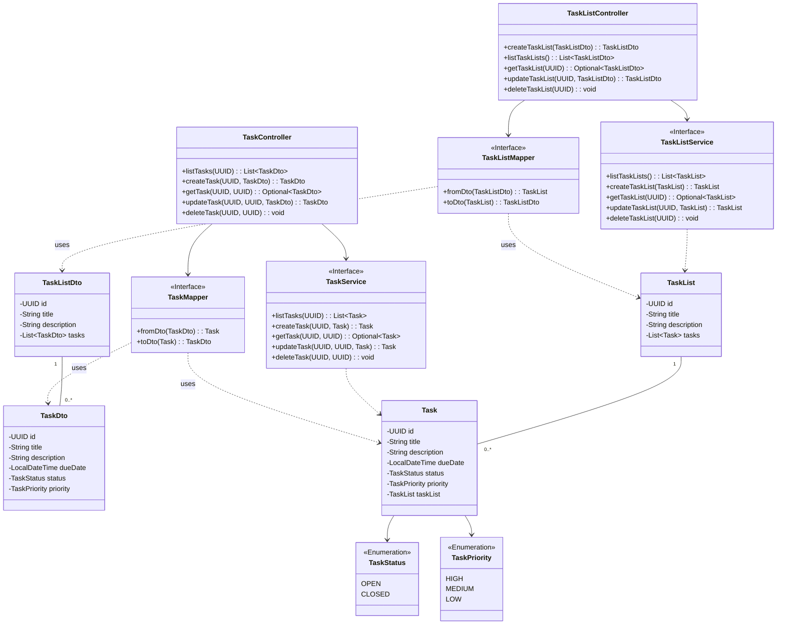

# Simple Task Manager

This is a simple task management application built with Spring Boot and React. The primary motivation for this project was to learn how to use Spring Boot Data JPA for database interactions.

## Project Overview

The application allows users to create, update, and manage tasks and task lists. It consists of a Spring Boot backend that provides a REST API for managing tasks and a React frontend for the user interface.

## Technologies Used

### Backend

*   **Spring Boot:** The core framework for the backend application.
*   **Spring Data JPA:** Used for persisting data to a relational database.
*   **H2 Database:** An in-memory database used for development and testing.
*   **PostgreSQL:** A production-ready relational database.
*   **Maven:** The build tool for the Java application.

### Frontend

*   **React:** A JavaScript library for building user interfaces.
*   **Vite:** A fast build tool for modern web projects.
*   **TypeScript:** A typed superset of JavaScript.
*   **Tailwind CSS:** A utility-first CSS framework.

## Getting Started

### Prerequisites

*   Java 24 or later
*   Node.js and npm
*   Docker and Docker Compose (optional, for running the database)

### Running the Application

1.  **Clone the repository:**

    ```bash
    git clone https://github.com/your-username/simple-task-manager.git
    cd simple-task-manager
    ```

2.  **Run the backend:**

    You can run the Spring Boot application using Maven:

    ```bash
    ./mvnw spring-boot:run
    ```

    The backend will be available at `http://localhost:8080`.

3.  **Run the frontend:**

    Navigate to the `react-fe` directory and install the dependencies:

    ```bash
    cd react-fe
    npm install
    ```

    Then, start the development server:

    ```bash
    npm run dev
    ```

    The frontend will be available at `http://localhost:5173`.

## Database Configuration

The application is configured to use an H2 in-memory database by default. You can switch to PostgreSQL by updating the `application.properties` file in `src/main/resources`.

## API Endpoints

The backend provides the following REST API endpoints:

*   `GET /api/task-lists`: Get all task lists.
*   `GET /api/task-lists/{id}`: Get a specific task list by ID.
*   `POST /api/task-lists`: Create a new task list.
*   `PUT /api/task-lists/{id}`: Update an existing task list.
*   `DELETE /api/task-lists/{id}`: Delete a task list.
*   `GET /api/tasks`: Get all tasks.
*   `GET /api/tasks/{id}`: Get a specific task by ID.
*   `POST /api/tasks`: Create a new task.
*   `PUT /api/tasks/{id}`: Update an existing task.
*   `DELETE /api/tasks/{id}`: Delete a task.

## Diagrams

### Entity Relationship Diagram


### Class Diagram


